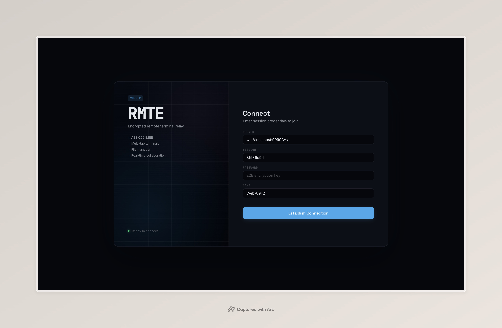
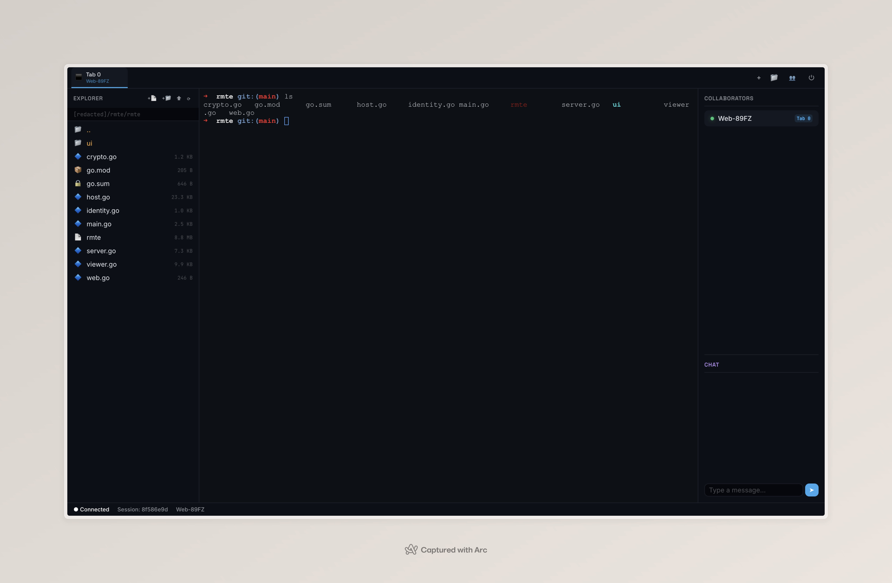

# RMTE — Remote Terminal Relay & Cloud IDE (v0.4.0)

> "I love sshx, but my endless curiosity to build it from scratch got the best of me 🥲"

RMTE is a secure, real-time, multi-user remote terminal sharing system and lightweight Cloud IDE. It is built entirely in Go with a centralized WebSocket relay architecture, securing all traffic with **AES-GCM 256-bit End-to-End Encryption (E2EE)**.

It allows hosts to share terminal sessions, navigate directories using a clean absolute-path File Explorer, and edit files in real-time via a multi-tab Web UI or an interactive TUI-based CLI client—all packed into a single binary.

---

## Screenshots

### Login


### IDE Workspace


---

<details>
<summary><h3>✨ Key Features (click to expand)</h3></summary>

* **Absolute Privacy (AES-GCM 256-bit):** Encryption keys and terminal/file I/O payloads are processed locally. The central relay server acts as a "dumb pipe" that only routes encrypted binary frames. It never sees your plaintext data, your files, or your password.
* **Single-Command Setup:** Run `rmte serve` to start a relay and host session in one process. A random password and a shareable link are printed automatically.
* **HTTP Compatible:** Works on plain HTTP (no HTTPS required). A built-in crypto polyfill (asmcrypto.js) handles AES-GCM when `crypto.subtle` is unavailable.
* **Shareable Links & Auto-fill UI:** Running a host session generates a web URL with pre-filled `?server=` and `?session=` parameters. The Web UI parses these and auto-focuses the password input for seamless onboarding.
* **Modern Web Redesign:** A sleek, split-viewport interface using OKLCH atmospheric themes, Space Grotesk/Inter/JetBrains Mono typography, and portable CSS design tokens (`tokens.css`).
* **Split-Workspace Cloud IDE:** Toggle the folder icon `📁` in the browser tab bar to open a split-view workspace:
  * **Left Panel**: Advanced File Explorer.
  * **Right Panel**: Tabbed text editor supporting file opening, modification warnings, and direct saving (`Ctrl + S`).
  * **Bottom Panel**: Interactive, multi-tab terminal shells.
* **Modern File Explorer & Manager:**
  * **Absolute PWD Display**: Displays the full, absolute working directory of the host (e.g. `C:/workspace/rmte`) with forward slash consistency.
  * **Editable Path Breadcrumbs**: Double-click the path header to type/edit the absolute folder path directly, then press `Enter ↵` to jump.
  * **Parent Navigation (`..`)**: An always-visible `..` folder item at the top of the file list allows walking backward up the host's directory structure.
  * **Inline Operations (Zero Browser Modals)**: Creating new files (`+📄`) or folders (`+📁`), renaming (`✏️`), and deleting (`🗑`) are performed via inline text inputs and non-intrusive confirmation strips (`[Yes] [No]`).
  * **Toast Notification HUD**: Directory and workspace errors are reported through transient, auto-dismissing inline Toasts.
* **Dynamic Max Buffer Limits:** Set customizable memory limits via CLI (e.g. `--buffer=5` for 5MB limits) to configure both the terminal ring buffer and the maximum allowed file sizes.
* **Zero-copy Binary Data Channel (Tab ID `255`):** Avoids heavy Base64 parsing overhead. Files are sent as pure, encrypted binary frames over a reserved channel.
* **Integrated Chat Room:** A memory-cached chat bridge connecting Web and CLI clients in real-time, preserving the last 50 messages.
* **Auto-Reconnect:** On unexpected disconnect, the web client retries with exponential backoff (2s → 4s → 8s → max 30s) with a live countdown in the status bar.
* **State Persistence & Auto-Reconnect:** Connection credentials live safely in `sessionStorage` for immediate recovery upon page refresh.

</details>

---

<details>
<summary><h3>🏗️ Architecture & Security Model (click to expand)</h3></summary>

```
┌───────────────┐                  ┌──────────────┐                  ┌───────────────┐
│               │  E2EE Control    │              │  E2EE Control    │               │
│               ├─────────────────►│              │◄─────────────────┤               │
│   Host Go     │                  │  Relay Go    │                  │  Viewer JS    │
│  Workspace    │  E2EE Tab 255    │  (WebSockets)│  E2EE Tab 255    │   Browser     │
│               │◄─────────────────┤              ├─────────────────►│               │
└───────────────┘  (Raw Binary)    └──────────────┘  (Raw Binary)    └───────────────┘
```

1. **E2EE Key Derivation**: A 256-bit key is derived locally from the shared password using SHA-256.
2. **AES-GCM Payload Envelope**: Control messages (JSON) and binary streams (terminal I/O & file operations) are encrypted using AES-GCM with a unique 12-byte initialization vector (IV) prepended to the ciphertext.
3. **Zero-Knowledge Relay**: The server only proxies binary envelopes and target routing IDs. It cannot read your commands, terminal outputs, or files.

</details>

---

## 📦 Installation

### Quick Download (Portable Binary to Current Directory)
Both scripts detect your OS and architecture automatically, downloading the ready-to-run binary directly into your current directory (`./rmte` or `.\rmte.exe`):

**Linux & macOS (curl / bash):**
```bash
curl -fsSL https://raw.githubusercontent.com/milio48/rmte/main/install/install.sh | bash
```

**Windows (PowerShell):**
```powershell
irm https://raw.githubusercontent.com/milio48/rmte/main/install/install.ps1 | iex
```
*Or using `curl.exe`:*
```powershell
curl.exe -fsSL https://raw.githubusercontent.com/milio48/rmte/main/install/install.ps1 -o install.ps1; powershell -ExecutionPolicy Bypass -File install.ps1; Remove-Item install.ps1
```

### Pre-built Binaries
Get the latest pre-built releases for your operating system directly from the GitHub releases page:
👉 **[RMTE GitHub Releases](https://github.com/milio48/rmte/releases)**

### Build from Source
Got Go installed (v1.21+)? Let's build the binary:
```bash
git clone https://github.com/milio48/rmte.git
cd rmte/rmte
go build -ldflags "-s -w" -o rmte
```

---

## 🧭 Terminology

| Term | Meaning | How |
| :--- | :--- | :--- |
| **Relay** | The machine that **opens a port** (HTTP Web UI + WebSocket routing) | `rmte serve` |
| **Host** | The **controlled machine** (shell + files) | `rmte serve` (standalone/hybrid) or `rmte share` |
| **Client** | Whoever controls the host: **Web** browser or **CLI/TUI** | Shareable link or `rmte join` |

## ⚖️ Commands & Modes

| | `serve --mode=standalone` *(default)* | `serve --mode=hybrid` | `serve --mode=relay` | `share` | `join` |
| :--- | :---: | :---: | :---: | :---: | :---: |
| Opens a port | ✅ | ✅ | ✅ | ❌ | ❌ |
| Local shell/files (Host) | ✅ | ✅ | ❌ | ✅ | ❌ |
| Accepts external hosts (`share`) | ❌ | ✅ | ✅ | — | — |
| Prints Session ID + links | ✅ | ✅ | ❌ | ✅ | — |
| Uses `--pass` / `--buffer` | ✅ | ✅ | ❌ | ✅ | `--pass` only |
| Role | Relay + Host | Relay + Host | Relay | Host | Client (TUI) |

---

## 🚀 Quick Start Guide

### 1. Quick local session
```bash
./rmte serve
```
Output:
```
RMTE v0.4.0 — Mode: standalone
────────────────────────────────────────────────
Bind:             127.0.0.1:8048
Host Name:        localhost
Rmte Port:        8048
Open to Relay:    ❌ No
Custom Password:  ❌ No  (generated: YJNhJkzGHEhc)
Session ID:       16fd7ce2
Buffer limit:     1 MB
Web Path:         /
WS Path:          /ws-rmte

Shareable link (Web Version):
  http://localhost:8048/?server=ws%3A%2F%2Flocalhost%3A8048%2Fws-rmte&session=16fd7ce2

Join CLI / TUI Version:
  rmte join --server-relay="ws://localhost:8048/ws-rmte" --id="16fd7ce2" --pass="YJNhJkzGHEhc"
```

### Case 1: Single VPS (self-contained)
One machine is both the relay and the host. External hosts are rejected.
```bash
./rmte serve --public --hostname="rmte.example.com" --pass="supersecret123"
```
```
┌────────────────────────────────────────────────────────┐
│ VPS_1: RELAY + HOST (rmte serve --public)              │
│ ✓ HTTP port 8048 (Web UI)                              │
│ ✓ WebSocket /ws-rmte (routing)                         │
│ ✓ Local shell & files                                  │
│ ✗ External hosts rejected (standalone)                 │
└───────────────────────────┬────────────────────────────┘
              ┌─────────────┼──────────────┐
           ┌──▼──┐       ┌──▼──┐       ┌───▼────┐
           │ CLI │       │ WEB │       │ WEB    │
           └─────┘       └─────┘       └────────┘
            join         browser        browser
```

### Case 2: Multi-VPS (central relay + separate hosts)
Only the relay opens a port. Hosts connect **outbound**, so they need no open ports.
```bash
# VPS_1 (relay only)
./rmte serve --mode=relay --public --hostname="relay.example.com"

# VPS_2, VPS_3, VPS_4 (each becomes a host with its own Session ID)
./rmte share --server-relay="ws://relay.example.com:8048/ws-rmte" --pass="supersecret123" --buffer=5
```
```
┌───────────────┐   ┌───────────────┐   ┌───────────────┐
│ VPS_2: HOST   │   │ VPS_3: HOST   │   │ VPS_4: HOST   │
│ (rmte share)  │   │ (rmte share)  │   │ (rmte share)  │
│ ✗ no open port│   │ ✗ no open port│   │ ✗ no open port│
└───────┬───────┘   └───────┬───────┘   └───────┬───────┘
        │ outbound WS       │                   │
        └───────────────────┼───────────────────┘
                            ▼
┌────────────────────────────────────────────────────────┐
│ VPS_1: RELAY (rmte serve --mode=relay --public)        │
│ ✓ HTTP port 8048 (Web UI)                              │
│ ✓ WebSocket /ws-rmte (routing)                         │
└───────────────────────────┬────────────────────────────┘
              ┌─────────────┼──────────────┐
           ┌──▼──┐       ┌──▼──┐       ┌───▼────┐
           │ CLI │       │ WEB │       │ WEB    │
           └─────┘       └─────┘       └────────┘
            join         browser        browser
```
> Want the relay machine to also be a host? Use `--mode=hybrid` instead of `--mode=relay`.

### Join via CLI Client (TUI)
```bash
./rmte join --server-relay="ws://relay.example.com:8048/ws-rmte" --id="a1b2c3d4" --pass="supersecret123"
```
You'll enter an interactive TUI menu:
* `[j]` **Join Tab:** Dive into the active terminal shell (Press `Ctrl + ]` to escape).
* `[n]` **New Tab:** Spawn a concurrent shell on the host.
* `[s]` **Switch Tab:** Hop between active terminal tabs.
* `[c]` **Chat:** Enter the real-time chat room.
* `[q]` **Quit:** Disconnect gracefully.

### Join via Web Client
Open the shareable link printed by `serve`/`share` (or browse to the relay's web path — the server URL is auto-filled).
1. Enter the E2EE **Password** and click **Establish Connection**.
2. Toggle the folder icon `📁` in the tab bar to access the workspace editor.
3. Double-click the breadcrumb to input any absolute path directly.

---

## 📖 Flag Reference

### `rmte serve`
| Flag | Default | Description |
| :--- | :--- | :--- |
| `--mode` | `standalone` | `standalone` \| `hybrid` \| `relay` |
| `--port` | `8048` | Listen port |
| `--pass` | *random* | E2EE password (printed if generated). Ignored in `relay` |
| `--buffer` | `1` | Terminal ring buffer & max file size (MB). Ignored in `relay` |
| `--web-path` | `/` | Path of the Web UI (e.g. `/web`) |
| `--ws-path` | `/ws-rmte` | WebSocket path |
| `--hostname` | `localhost` / `unknown` | Hostname/IP used **only** in printed links |
| `--public` | `false` | Bind `0.0.0.0` instead of `127.0.0.1` |
| `--no-web` | `false` | Don't serve the Web UI |
| `--no-cli` | `false` | Reject CLI clients (soft restriction: clients self-declare) |

### `rmte share`
| Flag | Default | Description |
| :--- | :--- | :--- |
| `--server-relay` | `ws://localhost:8048/ws-rmte` | Relay WebSocket URL |
| `--pass` | *random* | E2EE password (printed if generated) |
| `--buffer` | `1` | Terminal ring buffer & max file size (MB) |

### `rmte join`
| Flag | Default | Description |
| :--- | :--- | :--- |
| `--server-relay` | `ws://localhost:8048/ws-rmte` | Relay WebSocket URL |
| `--id` | *required* | Session ID |
| `--pass` | *required* | E2EE password |
| `--name` | *prompt* | Display name |

---

<details>
<summary><h3>🔄 Migrating from v0.3.x (click to expand)</h3></summary>

| v0.3.x | v0.4.0 |
| :--- | :--- |
| `rmte serve --port=8080` (relay) | `rmte serve --mode=relay --public` |
| `rmte serve --pass="x"` | `rmte serve --pass="x" --public` (standalone) |
| `--server="ws://host:8080/ws"` | `--server-relay="ws://host:8048/ws-rmte"` |
| Binds all interfaces | Binds `127.0.0.1` unless `--public` |
| Protocol `0.3` | Protocol `0.4` — run the same version on relay, hosts and clients |

</details>
